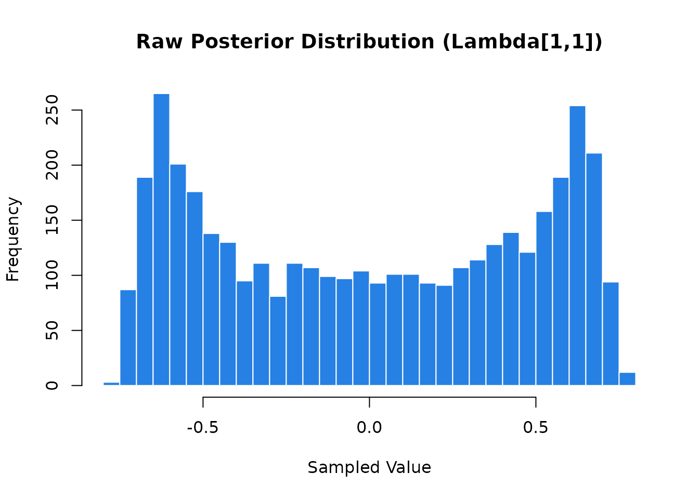
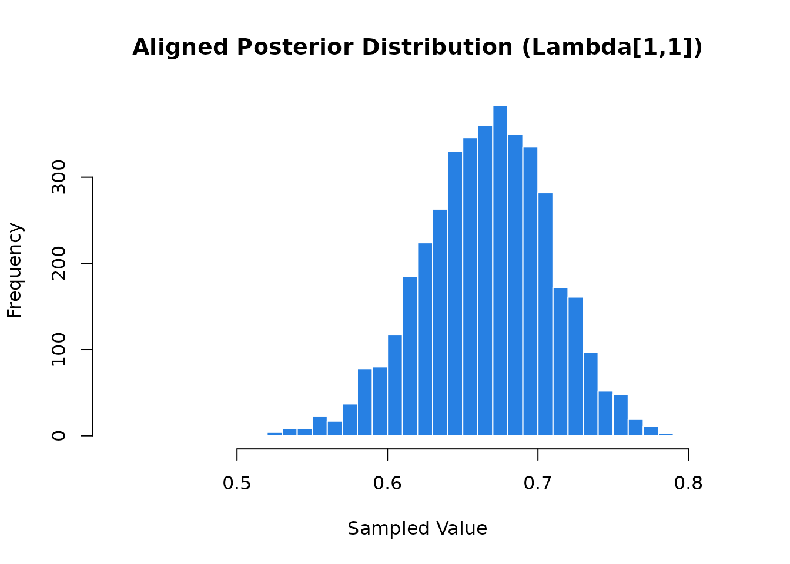

# Solving Rotational Indeterminacy

Bayesian EFA models suffer from rotational indeterminacy, causing MCMC
chains to “jump” between equivalent modes. This leads to label and sign
switching across iterations which, if left uncorrected, causes posterior
means to cancel out and results to become uninterpretable. To resolve
this, `BayesEFA` provides the
[`rsp_align()`](https://ricardoreysaez.github.io/BayesEFA/reference/rsp_align.md)
function. This implements the Efficient Rotation-Sign-Permutation
(E-RSP) algorithm proposed by Rey-Sáez & Revuelta (2026), an exact
alignment method that recovers the underlying factor structure in
seconds, even for high-dimensional models.

Let’s begin by generating a dataset from a simple, two-dimensional
latent structure. This will serve as our ground truth.

``` r
# Load BayesEFA
library(BayesEFA)

# Define a true loading matrix with a clear simple structure
L_true <- matrix(c(
  0.7, 0.0,
  0.7, 0.0,
  0.7, 0.0,
  0.0, 0.7,
  0.0, 0.7,
  0.0, 0.7
), ncol = 2, byrow = TRUE)

# Generate the corresponding correlation matrix
R_true <- tcrossprod(L_true)
diag(R_true) <- 1

# Simulate data for 300 observations
set.seed(2026)
X <- matrix(rnorm(300 * nrow(L_true)), ncol = nrow(L_true)) %*% chol(R_true)
colnames(X) <- paste0("Item_", 1:6)
```

## The unrotated solution

We will fit the Bayesian EFA model using
[`befa()`](https://ricardoreysaez.github.io/BayesEFA/reference/befa.md).
To illustrate the pathology of rotational indeterminacy, we explicitly
disable the internal alignment process by setting `rotate = "none"`.

``` r
# Fit the model without automatic post-processing
fit_unaligned <- befa(
  data = X,
  n_factors = 2,
  compute_fit_indices = FALSE,
  compute_reliability = FALSE,
  rotate = "none",
  backend = "rstan",
  seed = 17,
  refresh = 0,
  show_message = FALSE,
  show_exceptions = FALSE,
  chains = 4,
  parallel_chains = 1
)
#> 
#> Bayesian Exploratory Factor Analysis (BEFA)
#> ‗‗‗‗‗‗‗‗‗‗‗‗‗‗‗‗‗‗‗‗‗‗‗‗‗‗‗‗‗‗‗‗‗‗‗‗‗‗‗‗‗‗‗‗‗‗‗‗
#>    Model : 2 Factors | COR | UNIT_VECTOR Prior
#>    Data  : N = 300 observations | J = 6 items
#>    Engine: RStan
#> ‗‗‗‗‗‗‗‗‗‗‗‗‗‗‗‗‗‗‗‗‗‗‗‗‗‗‗‗‗‗‗‗‗‗‗‗‗‗‗‗‗‗‗‗‗‗‗‗
#>    Sampling posterior draws...
#> Skipping alignment (rotate = 'none')...
#> Bayesian Estimation Process Ended!

# Save posterior draws
draws_unaligned <- extract_posterior_draws(
  fit_unaligned,
  pars = "Lambda",
  format = "matrix"
)
```

As we will see below, attempting to summarize the posterior
distributions at this stage is meaningless due to rotational
indeterminacy. By not applying any post-hoc alignment or rotation
method, the MCMC chains have freely explored an unidentified, multimodal
parameter space, generating several obvious anomalies in the summaries:

- **Null summaries:** Means and medians collapse toward zero as
  equivalent rotations with opposing signs cancel each other out.
- **Extreme uncertainty:** Posterior SDs and credible intervals become
  massive (e.g., spanning from -0.8 to +0.8), rendering the estimates
  uninformative.
- **Poor convergence diagnostics:** The lack of identification causes
  unstable convergence, reflected in \\\hat{R}\\ values above 1.00 and
  low effective sample sizes, as indicated by the output warning.

``` r
posterior_summaries(fit_unaligned, pars = "Lambda")
#> # A tibble: 12 × 10
#>    variable       mean   median    sd   mad     q5   q95  rhat ess_bulk ess_tail
#>    <chr>         <dbl>    <dbl> <dbl> <dbl>  <dbl> <dbl> <dbl>    <dbl>    <dbl>
#>  1 Lambda[1,…  5.97e-3  0.0219  0.480 0.710 -0.666 0.674  1.00     483.    1583.
#>  2 Lambda[2,…  2.98e-4  0.0140  0.570 0.846 -0.790 0.792  1.00     491.    1400.
#>  3 Lambda[3,… -8.31e-4  0.0114  0.515 0.767 -0.717 0.720  1.00     478.    1441.
#>  4 Lambda[4,… -5.40e-2 -0.126   0.483 0.667 -0.689 0.679  1.01     487.    1169.
#>  5 Lambda[5,… -5.41e-2 -0.121   0.479 0.659 -0.689 0.676  1.01     515.    1781.
#>  6 Lambda[6,… -5.43e-2 -0.126   0.483 0.661 -0.692 0.678  1.01     507.    1696.
#>  7 Lambda[1,…  3.64e-3  0.00348 0.476 0.695 -0.665 0.676  1.01     508.    1603.
#>  8 Lambda[2,…  1.47e-3  0.0151  0.563 0.823 -0.789 0.788  1.01     489.    1415.
#>  9 Lambda[3,…  7.78e-4  0.0173  0.512 0.749 -0.721 0.719  1.01     491.    1588.
#> 10 Lambda[4,… -4.39e-3 -0.0155  0.488 0.723 -0.684 0.682  1.00     494.    1470.
#> 11 Lambda[5,… -3.58e-3 -0.0151  0.485 0.712 -0.680 0.679  1.00     500.    1470.
#> 12 Lambda[6,… -2.59e-3 -0.0163  0.489 0.717 -0.687 0.687  1.00     489.    1273.
```

A visual inspection of the posterior draws for a specific parameter
(e.g., `Lambda[1,2]`) makes the severity of this unidentified parameter
space immediately apparent:

``` r
hist(draws_unaligned[, "Lambda[1,2]"],
  breaks = 50,
  col = "#2780e3",
  border = "white",
  main = "Raw Posterior Distribution (Lambda[1,1])",
  xlab = "Sampled Value"
)
```



Instead of a clean, unimodal distribution centered around the true value
of \\0.7\\ (their true simulated value), we have a bimodal shape caused
by the sampler traversing different orthogonal rotations.

## The rotated solution

To align the results, we pass the raw MCMC matrix to rsp_align(). Since
samplers flatten multidimensional parameters (like the loading matrix
\\\mathbf{\Lambda}\\) into vectors, the function requires specific
formatting:

1.  **`lambda_draws`**: A numeric matrix of \\S \times (J \times M)\\,
    where \\S\\ is the total number of draws, \\J\\ is the number of
    items, and \\M\\ is the number of factors.
2.  **`n_chains`**: The number of MCMC chains. The function assumes the
    rows in `lambda_draws` are stacked chain by chain (e.g., if you have
    4000 draws from 4 chains, rows 1-1000 belong to chain 1, rows
    1001-2000 to chain 2, etc.).
3.  **`format`**: The most critical argument; it specifies how your MCMC
    software flattened the original \\J \times M\\ loading matrix into a
    single row.

### Understanding Flattening Formats

The lambda_draws input must be a 2D matrix of dimensions \\S \times (J
\times M)\\. Since MCMC samplers flatten the original \\J \times M\\
loading matrix \\\mathbf{\Lambda}\\ into a single row vector, the format
argument tells the function how to reconstruct it.

Consider a \\4 \times 3\\ loading matrix (4 items, 3 factors): \\
\mathbf{\Lambda} = \begin{bmatrix} \lambda\_{11} & \lambda\_{12} &
\lambda\_{13} \\ \lambda\_{21} & \lambda\_{22} & \lambda\_{23} \\
\lambda\_{31} & \lambda\_{32} & \lambda\_{33} \\ \lambda\_{41} &
\lambda\_{42} & \lambda\_{43} \end{bmatrix} \\

Depending on your MCMC software, the input rows must follow one of these
two structures:

1.  **Column-major** (`format = "column_major"`): Elements are filled
    **factor by factor**. This is the default output for `Stan` and
    matches the `as.vector(Lambda)` behavior in R:

\\ \text{vec}(\mathbf{\Lambda}) = \[ \underbrace{\lambda\_{11},
\lambda\_{21}, \lambda\_{31}, \lambda\_{41}}\_{\text{Factor 1}}, \\
\underbrace{\lambda\_{12}, \lambda\_{22}, \lambda\_{32},
\lambda\_{42}}\_{\text{Factor 2}}, \\ \underbrace{\lambda\_{13},
\lambda\_{23}, \lambda\_{33}, \lambda\_{43}}\_{\text{Factor 3}} \] \\

2.  **Row-major** (`format = "row_major"`): Elements are filled item by
    item. This corresponds to as.vector(t(Lambda)) in R:

\\ \text{vec}(\mathbf{\Lambda}^\top) = \[ \underbrace{\lambda\_{11},
\lambda\_{12}, \lambda\_{13}}\_{\text{Item 1}}, \\
\underbrace{\lambda\_{21}, \lambda\_{22}, \lambda\_{23}}\_{\text{Item
2}}, \\ \underbrace{\lambda\_{31}, \lambda\_{32},
\lambda\_{33}}\_{\text{Item 3}}, \\ \underbrace{\lambda\_{41},
\lambda\_{42}, \lambda\_{43}}\_{\text{Item 4}} \] \\

We can easily visualize this difference by looking at the column names
of our extracted draws. For an \\6 \times 2\\ loading matrix:

``` r
# 1. Draws in column-major order (Stan's default)
# Notice how it fills Factor 1 completely before moving to Factor 2
colnames(draws_unaligned)
#>  [1] "Lambda[1,1]" "Lambda[2,1]" "Lambda[3,1]" "Lambda[4,1]" "Lambda[5,1]"
#>  [6] "Lambda[6,1]" "Lambda[1,2]" "Lambda[2,2]" "Lambda[3,2]" "Lambda[4,2]"
#> [11] "Lambda[5,2]" "Lambda[6,2]"

# 2. Draws in row-major order
# We can simulate this order by transposing the index matrix
rw_ord <- rep(1:6, each = 2) + rep(c(0, 6), times = 2)
colnames(draws_unaligned)[rw_ord]
#>  [1] "Lambda[1,1]" "Lambda[1,2]" "Lambda[2,1]" "Lambda[2,2]" "Lambda[3,1]"
#>  [6] "Lambda[3,2]" "Lambda[4,1]" "Lambda[4,2]" "Lambda[5,1]" "Lambda[5,2]"
#> [11] "Lambda[6,1]" "Lambda[6,2]"
```

### Resolving the Latent Structure

Now that we have the correct format, we can apply the alignment
algorithm. In this example (6 items, 2 factors, 4 chains), we use the
`column_major` format to match our extraction tool:

``` r
# Apply the Efficient RSP algorithm
aligned_res <- rsp_align(
  lambda_draws = draws_unaligned,
  n_items = 6,
  n_factors = 2,
  n_chains = 4,
  format = "column_major"
)
```

By aligning the posterior draws, rotational indeterminacy is fully
resolved. The previously observed anomalies disappear, and the true
factor structure emerges with high precision and clarity:

- **Clear Factor Structure:** The previous non-significant loadings have
  been replaced by a perfect simple structure. Items 1–3 now load onto
  Factor 2, with \\\lambda \approx .68\\ across all items, while Items
  4–6 load onto Factor 1, with loadings ranging from \\0.66\\ to
  \\0.80\\.
- **High precision:** Posterior standard deviations have decreased
  significantly, from \\\approx 0.50\\ down to \\0.04\\, resulting in
  narrow, informative credible intervals that clearly exclude zero for
  all main loadings.
- **Perfect convergence and mixing:** With the model now identified,
  MCMC diagnostics are perfect. All \\\hat{R}\\ values have stabilized
  at \\1.00\\, and effective sample sizes (ESS) have increased
  significantly (well over 2000), confirming efficient mixing and stable
  chains.

``` r
# Now, aligned posterior summaries are interpretable
aligned_res$summary
#> # A tibble: 12 × 10
#>    variable        mean   median     sd    mad      q5     q95  rhat ess_bulk
#>    <chr>          <dbl>    <dbl>  <dbl>  <dbl>   <dbl>   <dbl> <dbl>    <dbl>
#>  1 Lambda[1,1] -0.0972  -0.0964  0.0516 0.0515 -0.181  -0.0151 1.000    3911.
#>  2 Lambda[2,1] -0.0145  -0.0144  0.0433 0.0397 -0.0810  0.0543 1.00     3994.
#>  3 Lambda[3,1]  0.00822  0.00986 0.0472 0.0448 -0.0685  0.0832 1.00     4130.
#>  4 Lambda[4,1]  0.683    0.684   0.0472 0.0461  0.603   0.760  1.00     2589.
#>  5 Lambda[5,1]  0.680    0.683   0.0488 0.0490  0.597   0.756  1.00     2708.
#>  6 Lambda[6,1]  0.685    0.687   0.0461 0.0455  0.608   0.760  1.00     3033.
#>  7 Lambda[1,2]  0.666    0.668   0.0427 0.0418  0.592   0.733  1.00     2962.
#>  8 Lambda[2,2]  0.798    0.800   0.0405 0.0390  0.730   0.862  1.00     2756.
#>  9 Lambda[3,2]  0.723    0.725   0.0398 0.0392  0.657   0.787  1.00     2843.
#> 10 Lambda[4,2] -0.0491  -0.0493  0.0487 0.0483 -0.127   0.0273 1.00     3937.
#> 11 Lambda[5,2] -0.00346 -0.00336 0.0495 0.0484 -0.0836  0.0772 1.00     3990.
#> 12 Lambda[6,2] -0.0337  -0.0337  0.0482 0.0482 -0.113   0.0428 1.00     3842.
#> # ℹ 1 more variable: ess_tail <dbl>
```

Re-visualizing the posterior distribution for `Lambda[1,1]` after
alignment provides clear visual proof that the parameter is now
identified. The formerly erratic, multimodal draws have successfully
resolved into a clean, unimodal distribution, confirming that rotational
indeterminacy has been completely eliminated.

``` r
# Retrieve the clean, aligned posterior matrix
draws_aligned <- aligned_res$Lambda_hat_mcmc

# The output maintains the exact dimensions and format of the input
hist(draws_aligned[, "Lambda[1,2]"],
  breaks = 50,
  col = "#2780e3",
  border = "white",
  main = "Aligned Posterior Distribution (Lambda[1,1])",
  xlab = "Sampled Value"
)
```



## References

- Papastamoulis, P., & Ntzoufras, I. (2022). On the identifiability of
  Bayesian factor analytic models. *Statistics and Computing,
  32*(2), 23. <https://doi.org/10.1007/s11222-022-10084-4>
- Rey-Sáez, R. & Revuelta, J. (2026). *An Efficient
  Rotation-Sign-Permutation Algorithm to Solve Rotational Indeterminacy
  in Bayesian Exploratory Factor Analysis*. PsyArXiv.
  <https://osf.io/5dutv/>
