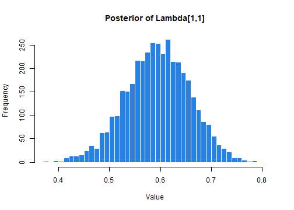

## Introduction

`BayesEFA` provides a robust and intuitive framework for Bayesian Exploratory Factor Analysis using `Stan`.

- **Unconstraint Estimation**: Fit unrestricted loading matrices without fixing parameters or using arbitrary identification constraints.
- **Resolved Rotational Indeterminacy**: Recover interpretable posteriors through the Efficient Rotation-Sign-Permutation (E-RSP) alignment algorithm.
- **Bayesian SEM Fit Measures**: Includes the Bayesian SEM fit indices proposed by Garnier-Villarreal & Jorgensen (2020) for model evaluation.
- **Full Posterior Inference**: Obtain complete distributions for all quantities, including factor loadings, factor scores, fit measures, and reliability indices.
- **FIML for Missing Data**: Handles incomplete datasets via Full Information Maximum Likelihood (FIML). 
- **Inherent Robustness**: Naturally resolves common frequentist issues, such as Heywood cases and non-positive definite matrices, ensuring stable estimation.

While the package supports both `rstan` and `cmdstanr`, `rstan` is used as the default backend. However, we strongly recommend using `cmdstanr` for users who prefer the latest Stan features and faster estimation, `cmdstanr` can be installed by following the [official guide](https://mc-stan.org/cmdstanr/articles/cmdstanr.html).

> Note: The `BayesEFA` model compiles only once when first using `cmdstanr.` It is permanently saved in your system's cache and will persist across R sessions and computer reboots. If you ever need to force a recompile (e.g., after updating `cmdstanr`), you must manually clear the cache by running: `unlink(tools::R_user_dir("BayesEFA", which = "cache"), recursive = TRUE)`.

## Basic example using BayesEFA

The following workflow fits a 3-factor model using the `befa()` function, handling estimation, rotation, and post-processing in a single step:


``` r
library(BayesEFA)

# Fit Bayesian EFA model
befa_fit <- befa(
  data = HS_data,                  # Data
  n_factors = 3,                   # Nº of latent factors
  model = "cor",                   # Model the correlation matrix
  lambda_prior = "unit_vector",    # Unit-vector prior (Rey-Sáez et al., 2025)
  rotate = "varimax",              # Automatic Varimax + E-RSP Alignment
  backend = "rstan",               # Estimation backend, also "cmdstanr"
  factor_scores = TRUE,            # Compute Bayesian factor scores
  compute_fit_indices = TRUE,      # Compute Bayesian SEM fit indices
  compute_reliability = TRUE,      # Compute reliability indices
  iter_sampling = 1000,            # Sampling iterations
  iter_warmup = 1000,              # Warmup iterations
  chains = 4,                      # 4 MCMC chains
  parallel_chains = 4,             # 4 parallel chains
  seed = 17                        # seed for reproducible results
)
```

The `befa_fit` object contains a standard `stanfit` object (from `rstan`). This ensures full compatibility with the Stan ecosystem, allowing you to use your favorite diagnostic tools and plots—regardless of whether you used `cmdstanr` or `rstan` as the backend.

## Basic model summaries

The `summary()` method provides reportable tables inspired by the `psych` package, ensuring a familiar experience for EFA researchers. We can use two arguments for the output: 

-   `cutoff`: Hides loadings below a specific threshold (e.g., 0.3) for a cleaner pattern matrix.
-   `signif_stars`: Adds an asterisk (`*`) to loadings whose 95% Credible Interval excludes zero.


``` r
summary(befa_fit, cutoff = 0.3, signif_stars = TRUE)
#> 
#> Table 1. Factor Loadings (Pattern Matrix) 
#> ‗‗‗‗‗‗‗‗‗‗‗‗‗‗‗‗‗‗‗‗‗‗‗‗‗‗‗‗‗‗‗‗‗‗‗‗‗‗‗‗‗‗‗‗‗‗‗‗‗‗‗‗‗‗‗‗‗‗‗‗‗‗‗‗‗‗‗ 
#> Variable       F1     F2     F3    h2    u2  Rhat  EssBulk  EssTail
#> ———————————————————————————————————————————————————————————————————
#> Item_1      0.59*  0.31*         0.47  0.53  1.00     3458     2849
#> Item_2      0.46*                0.23  0.77  1.00     4053     2741
#> Item_3      0.65*                0.44  0.56  1.00     4146     2274
#> Item_4             0.83*         0.71  0.29  1.00     4156     2607
#> Item_5             0.86*         0.75  0.25  1.00     4179     2983
#> Item_6             0.81*         0.68  0.32  1.00     4291     2817
#> Item_7                    0.68*  0.48  0.52  1.00     3343     2081
#> Item_8                    0.69*  0.52  0.48  1.00     3614     2593
#> Item_9      0.40*         0.49*  0.43  0.57  1.00     3014     2757
#> ‗‗‗‗‗‗‗‗‗‗‗‗‗‗‗‗‗‗‗‗‗‗‗‗‗‗‗‗‗‗‗‗‗‗‗‗‗‗‗‗‗‗‗‗‗‗‗‗‗‗‗‗‗‗‗‗‗‗‗‗‗‗‗‗‗‗‗ 
#> Note: varimax rotation applied. Diagnostics show worst-case values
#> across factors (max Rhat, min ESS). The 3 latent factors accounted
#> for 52.2% of total variance. (*) 95% Credible Interval excludes 0.
#> Loadings with absolute values < 0.30 are hidden. 
#> 
#> Table 2. Bayesian Fit Measures 
#> ‗‗‗‗‗‗‗‗‗‗‗‗‗‗‗‗‗‗‗‗‗‗‗‗‗‗‗‗‗‗‗‗‗‗‗‗‗‗‗‗‗‗‗‗‗‗‗‗‗ 
#> Index         Estimate     SD    CI_Low   CI_High
#> —————————————————————————————————————————————————
#> Chi2             47.75   7.24     35.81     63.71
#> Chi2_ppp          0.12                           
#> Chi2_Null       918.85   0.00    918.85    918.85
#> BRMSEA            0.06   0.02      0.00      0.09
#> BGamma            0.99   0.01      0.98      1.00
#> Adj_BGamma        0.97   0.02      0.93      1.00
#> BMc               0.98   0.01      0.96      1.00
#> SRMR              0.05   0.01      0.03      0.06
#> BCFI              0.99   0.01      0.97      1.00
#> BTLI              0.99   0.02      0.93      1.00
#> ELPD          -3416.93  42.49  -3500.21  -3333.64
#> LOOIC          6833.85  84.98   6667.29   7000.42
#> p_loo            25.58   1.82     22.01     29.14
#> ‗‗‗‗‗‗‗‗‗‗‗‗‗‗‗‗‗‗‗‗‗‗‗‗‗‗‗‗‗‗‗‗‗‗‗‗‗‗‗‗‗‗‗‗‗‗‗‗‗ 
#> Note: Intervals are 95% Credible Intervals. PPP:
#> Posterior Predictive p-value (Ideal > .05).
#> p_loo/LOOIC derived from PSIS-LOO. 
#> 
#> Table 3. Factor Reliability (Coefficient Omega) 
#> ‗‗‗‗‗‗‗‗‗‗‗‗‗‗‗‗‗‗‗‗‗‗‗‗‗‗‗‗‗‗‗‗‗‗‗‗‗‗‗‗‗ 
#> Factor    Estimate    SD  CI_Low  CI_High
#> —————————————————————————————————————————
#> F1            0.60  0.04    0.52     0.67
#> F2            0.73  0.02    0.69     0.76
#> F3            0.55  0.04    0.45     0.62
#> ‗‗‗‗‗‗‗‗‗‗‗‗‗‗‗‗‗‗‗‗‗‗‗‗‗‗‗‗‗‗‗‗‗‗‗‗‗‗‗‗‗ 
#> Full Scale Omega Total: 0.84 [0.82,
#> 0.86]. Omega coefficients use the full
#> posterior distribution.
```

## Extract and summarise posterior draws

For deeper inspection, `BayesEFA` provides tools to extract raw MCMC draws or compute detailed diagnostics:

- `extract_posterior_draws()`: Returns raw MCMC samples for any parameter. This is ideal for custom visualizations or density plots.
- `posterior_summaries()`: A convenient wrapper that computes descriptive statistics and essential convergence diagnostics (e.g., $\hat{R}$ and Effective Sample Size).


``` r
# 1. Extract raw draws for factor loadings
draws <- extract_posterior_draws(befa_fit, pars = "Lambda", format = "matrix")

# Visualize the posterior distribution of a specific loading
hist(draws[, "Lambda[1,1]"],
  breaks = 50,
  col = "#2780e3",
  border = "white",
  main = "Posterior of Lambda[1,1]",
  xlab = "Value"
)
```



``` r

# 2. Get automated summaries and diagnostics
posterior_summaries(befa_fit, pars = "h2")
#> # A tibble: 9 × 10
#>   variable  mean median     sd    mad    q5   q95  rhat ess_bulk
#>   <chr>    <dbl>  <dbl>  <dbl>  <dbl> <dbl> <dbl> <dbl>    <dbl>
#> 1 h2[1]    0.476  0.474 0.0645 0.0622 0.370 0.584 1.00     4808.
#> 2 h2[2]    0.240  0.237 0.0569 0.0568 0.148 0.338 1.00     4910.
#> 3 h2[3]    0.447  0.442 0.0791 0.0770 0.325 0.582 1.00     4352.
#> 4 h2[4]    0.715  0.717 0.0364 0.0356 0.654 0.774 1.00     5036.
#> 5 h2[5]    0.751  0.752 0.0386 0.0384 0.686 0.812 1.00     5169.
#> 6 h2[6]    0.687  0.688 0.0358 0.0360 0.626 0.743 1.00     4945.
#> 7 h2[7]    0.486  0.479 0.103  0.0990 0.332 0.669 1.00     3504.
#> 8 h2[8]    0.527  0.523 0.0873 0.0846 0.390 0.674 1.00     3800.
#> 9 h2[9]    0.442  0.441 0.0560 0.0549 0.350 0.533 1.000    4101.
#> # ℹ 1 more variable: ess_tail <dbl>
```

## References

- Garnier-Villarreal, M., & Jorgensen, T. D. (2020). Adapting fit indices for Bayesian structural equation modeling: Comparison to maximum likelihood. *Psychological methods, 25*(1), 46–70. <https://doi.org/10.1037/met0000224>
- Holzinger, K. J., and F. A. Swineford. 1939. *A Study of Factor Analysis: The Stability of a Bi-Factor Solution.* Supplementary Educational Monograph 48. Chicago: University of Chicago Press.
- McDonald, R. P. (1999). *Test Theory: A Unified Treatment*. Lawrence Erlbaum Associates.
- Rey-Sáez, R., Franco-Martínez, A., Revuelta, J., & Vadillo, M. A. (2025). *A Unified Framework for Psychometrics in Experimental Psychology: The Standardized Generalized Hierarchical Factor Model*. PsyArXiv. <https://doi.org/10.31234/osf.io/gv6k7_v1>
- Rey-Sáez, R. & Revuelta, J. (2026). *An Efficient Rotation-Sign-Permutation Algorithm to Solve Rotational Indeterminacy in Bayesian Exploratory Factor Analysis*. PsyArXiv. <https://osf.io/5dutv/>
